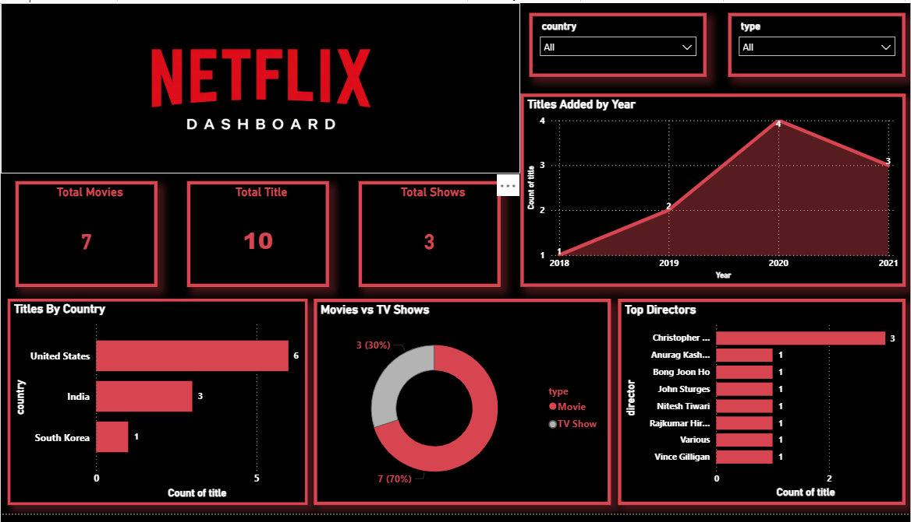

# Netflix Content Analysis using SQL and Power BI

## Overview

This project analyzes Netflix content data to uncover patterns in content type, release trends, country distribution, and director contribution. Using SQL for data analysis and Power BI for visualization, the project turns raw entertainment data into an interactive dashboard with clear business-style insights.

## Objective

The objective of this project is to explore Netflix titles and build a dashboard that helps answer questions such as:

* How many total titles are available?
* What is the split between Movies and TV Shows?
* Which countries contribute the most titles?
* How has content addition changed over time?
* Which directors appear most frequently in the dataset?

## Tools Used

* MySQL
* Power BI
* Excel

## Dataset Information

The dataset contains Netflix titles with attributes such as:

* show_id
* type
* title
* director
* country
* date_added
* release_year
* rating
* duration
* listed_in

## Project Workflow

1. Collected and loaded the dataset
2. Cleaned and explored the data
3. Wrote SQL queries to analyze content distribution and trends
4. Built an interactive Power BI dashboard
5. Derived insights from visual analysis

## Dashboard Features

The dashboard includes:

* **KPI Cards**

  * Total Titles
  * Total Movies
  * Total TV Shows

* **Visuals**

  * Titles Added by Year
  * Titles by Country
  * Movies vs TV Shows
  * Top Directors

* **Slicers**

  * Country
  * Type

## Key Insights

- Movies form the majority of content, indicating stronger focus on film-based content  
- The United States dominates content production in the dataset  
- Content addition peaked around 2020, suggesting rapid platform growth  
- Most directors contribute a single title, while a few contribute multiple titles  

## SQL Analysis Included

Some of the analysis performed in SQL:

* Count of total titles
* Movies vs TV Shows distribution
* Titles added by year
* Country-wise title count
* Director-wise title count
* Genre-wise title count

Netflix-Content-Analysis/
│
├── data/
├── dashboard/
├── images/
├── sql/
└── README.md

## What this project demonstrates

- Ability to clean and analyze real-world data  
- Strong understanding of data visualization principles  
- Capability to build interactive dashboards  
- Ability to derive meaningful insights from data  

## How to Use

1. Download the dataset from the `data` folder
2. Open the SQL file to review analysis queries
3. Open the Power BI file to interact with the dashboard
4. Use slicers to filter results by country and type

## What I Learned

Through this project, I strengthened my skills in:

* SQL querying
* Data cleaning
* Data visualization
* Dashboard design
* Insight generation

## Conclusion

This project demonstrates my ability to take a raw dataset, analyze it using SQL, and present findings through an interactive Power BI dashboard. It reflects both technical skills and business-oriented analytical thinking.

This project demonstrates my ability to take a raw dataset, analyze it using SQL, and present findings through an interactive Power BI dashboard. It reflects both technical skills and business-oriented analytical thinking.
